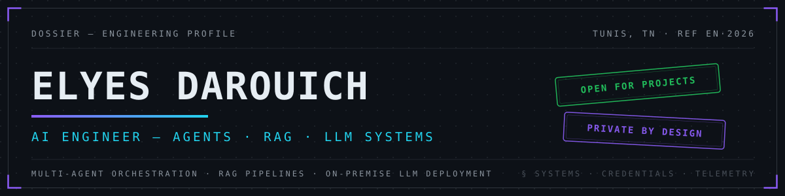

 

<samp>§ 00 · ABSTRACT</samp>

I build AI systems that run where the data lives. At **Talan** I engineered an ISO compliance
auditor that reads a company's entire management system and returns clause-by-clause verdicts
with cited evidence — on infrastructure the client controls. After hours I build **EDITH**, a
persistent AI companion that never sends a byte to the cloud. Multi-agent orchestration, RAG
pipelines, private LLM deployment: the common thread is generative AI that doesn't require
handing your data to someone else.

Engineering degree at **ESPRIT** (2026) · French & Arabic native, English fluent · Some systems
below ship from my second account, [@ElyesDarouich](https://github.com/ElyesDarouich).

 

<samp>§ 01 · SYSTEM REGISTER</samp>

| REF | SYSTEM | FUNCTION | STACK | ACCESS |
|:--|:--|:--|:--|:--|
| `SYS·01` | **[EDITH](https://github.com/ElyesD1/EDITH)** | Persistent, 100% local AI companion for macOS — an always-alive daemon that wakes the model only when cognition is needed | Python · Swift/SwiftUI · Ollama · LoRA | `PRIVATE BUILD` |
| `SYS·02` | **SMI Virtual Auditor** | AI auditor for ISO 9001 / 14001 / 27001 — clause-by-clause compliance verdicts with cited evidence, built at Talan | Llama 3.3 70B · RAG · FastAPI · React | `CLIENT — TALAN` |
| `SYS·03` | **[SentinelAI](https://github.com/ElyesD1/SentinelAI)** | 7-agent LangGraph pipeline analyzing geopolitical risk for Gold, Oil, S&P 500, BTC & ETH — full report in under 30 s | LangGraph · Qdrant · GARCH · Monte Carlo | `OPEN SOURCE` |
| `SYS·04` | **ScribeAI** | Meeting intelligence — real-time diarized transcription (EN · FR · AR · Tunisian) into structured docs and architecture diagrams | ElevenLabs Scribe · ChromaDB · Mermaid | `PRIVATE BUILD` |
| `SYS·05` | **[Claude Hive](https://github.com/ElyesDarouich/claude-hive)** | Coordination layer letting multiple Claude Code agents share live awareness, avoid file conflicts, and delegate tasks | MCP · Supabase Realtime · Python | `OPEN SOURCE` |
| `SYS·06` | **[Agentic Valley](https://github.com/ElyesDarouich/Agentic-Valley)** | VSCode extension rendering multi-agent orchestration as a living pixel-art office — every delegation visible | Claude Agent SDK · TypeScript | `OPEN SOURCE` |
| `SYS·07` | **[ZK-Attest](https://github.com/ElyesDarouich/zk-attest)** | Prove credentials — age, ISO 27001 auditor status, experience — without revealing the underlying data | Groth16 · Circom · W3C VC · Besu | `OPEN SOURCE` |

<samp>&nbsp;EXPAND — system specifications</samp>

 

**`SYS·01` EDITH — Local AI Companion**
- Always-alive Python daemon handles state, memory, and event prioritization; the LLM (via Ollama) wakes only when cognition is required, then sleeps — idle footprint under ~1 GB
- Long-term memory in SQLite; personality, rules, and ethics defined in user-owned persona files with trained LoRA adapters — not vendor defaults
- Swift/SwiftUI menu-bar app provides presence, HUD, global hotkey, and perception sensors

**`SYS·02` SMI Virtual Auditor — AI ISO Compliance Auditor (Talan, end-of-studies project)**
- 3-pass RAG pipeline producing `COMPLIANT / PARTIAL / NON-COMPLIANT` verdicts with cited evidence, confidence scores, and recommendations across 110 clauses (ISO 9001, 14001, 27001 + Talan Forfait)
- 7-layer guard rails — groundedness, fidelity, contradiction, consistency, confidence capping — to prevent hallucinated findings
- Clean-Architecture FastAPI backend: JWT RS256 + RBAC, Celery workers, PostgreSQL, Redis, MinIO, fully Dockerized; React 18 + TypeScript SPA with streaming RAG chat and PDF audit reports; 108 unit tests
- Retained by Talan as an internal demonstrator

**`SYS·03` SentinelAI — Geopolitical Market Intelligence**
- 7-agent pipeline: routing → geo intel → sentiment → per-asset analysis → quant/risk → critic → synthesis
- Monte Carlo simulation and GARCH volatility modeling; semantic news search over GDELT + FRED via Qdrant
- $0 LLM cost through free-tier rotation across Groq, OpenRouter & Together.ai; JWT + RBAC, reCAPTCHA v3, WAF hardening

**`SYS·04` ScribeAI — Meeting Intelligence**
- Real-time transcription with speaker diarization across English, French, Arabic, and Tunisian dialect — including code-switching and RTL PDF rendering
- 9-step AI pipeline: requirements extraction, ambiguity detection, auto-generated Mermaid architecture diagrams with conversational refinement
- React → Flask WebSocket + FastAPI + Ollama; zero cloud inference cost

**`SYS·05` Claude Hive — Multi-Agent Coordination**
- Per-machine daemon streams scrubbed tool-call events over a private Supabase Realtime channel — tokens and secrets redacted before transmission, never code or model output
- Eight MCP tools expose rooms, messaging, and formal task delegation (accept / reject / complete) inside any Claude Code session
- VSCode observer dashboard with live event feed; supervised by launchd / systemd

**`SYS·06` Agentic Valley — Orchestration Visualizer**
- Seven specialized agents (architect, researcher, code-generator, reviewer, tester…) each in its own Claude Agent SDK session, orchestrated by a main agent via the Task tool
- State-driven sprite animation (idle / thinking / tool-use / error) with dispatch cards and particle bursts — coordination made perceptually observable
- Token-by-token streaming chat per agent inside a VSCode webview

**`SYS·07` ZK-Attest — Zero-Knowledge Credential Verification**
- Groth16 circuits (Circom + snarkjs) prove predicates — "18+", "ISO 27001 Lead Auditor valid", "experience ≥ N" — as 288-byte SNARKs; the verifier receives a single yes/no bit
- Multi-issuer on-chain trust chain via ERC-5192 soulbound NFTs (Hyperledger Besu); RFC 9162 transparency log with signed tree heads
- OpenID4VP / EUDI-wallet-compatible presentations; Next.js 15 monorepo with Web-Worker proof generation

<samp>&nbsp;ARCHIVE — earlier systems (full-stack & mobile era)</samp>

 

| REF | SYSTEM | FUNCTION | ACCESS |
|:--|:--|:--|:--|
| `ARC·01` | **ProjectFlow** (Talan internship) | Cross-platform project management with a Gemini-powered assistant — Kanban, WebSocket collab, <150 ms API at 100+ users | `CLIENT` |
| `ARC·02` | **[WABAG Gestion de Caisse](https://github.com/ElyesD1/wabag-gestion-caisse)** | Cash-desk management desktop app for VA Tech WABAG — Electron + embedded Node + MongoDB Atlas | `OPEN SOURCE` |
| `ARC·03` | **[WABAG Bureau d'Ordre](https://github.com/ElyesD1/wabag-bureau-ordre)** | Mail-registry desktop app — Electron + FastAPI + MongoDB | `OPEN SOURCE` |
| `ARC·04` | **Riftpedia** | iOS League of Legends match tracker — SwiftUI, MapKit Runeterra map, Riot API | `PRIVATE BUILD` |
| `ARC·05` | **[SquadLink](https://github.com/ElyesD1/SquadLink)** | LoL team finder — Socket.io matchmaking, Riot API, Discord bot | `OPEN SOURCE` |
| `ARC·06` | **[Dialex](https://github.com/ElyesD1/Dialex-Front-IOS)** | Native iOS app ([backend](https://github.com/ElyesD1/Dialex-Backed)) — SwiftUI + NestJS | `OPEN SOURCE` |
| `ARC·07` | **[Nomadly](https://github.com/ElyesD1/Nomadly-Front)** | Travel platform — Flutter front, [NestJS back](https://github.com/ElyesD1/Nomadly-back) | `OPEN SOURCE` |

 

<samp>§ 02 · INSTRUMENTATION</samp>

 

**AI / ML**

**BACKEND & INFRA**

**INTERFACES**

 

<samp>§ 03 · CREDENTIALS</samp>

| REF | CREDENTIAL | ISSUER | ISSUED | VERIFICATION |
|:--|:--|:--|:--|:--|
| `CRED·01` | Generative AI with Diffusion Models | NVIDIA Deep Learning Institute | 2025 | [`VERIFY ↗`](https://learn.nvidia.com/certificates?id=NBN_yYZrQritFRoiorrdZg) |
| `CRED·02` | Applications of AI for Predictive Maintenance | NVIDIA Deep Learning Institute | 2025 | [`VERIFY ↗`](https://learn.nvidia.com/certificates?id=DfIs6wnhTa204pXqdLB7hw) |
| `CRED·03` | Hashgraph Developer Course | The Hashgraph Association | 2025 | `NFT CREDENTIAL` |
| `CRED·04` | AWS Academy — Cloud Foundations | AWS Academy | 2024 | `CREDLY BADGE` |

 

<samp>§ 04 · TELEMETRY</samp>

 

<picture>
  <source media="(prefers-color-scheme: dark)" srcset="https://github-readme-stats.vercel.app/api?username=ElyesD1&show_icons=true&hide_border=true&bg_color=00000000&title_color=8b5cf6&icon_color=22d3ee&text_color=8b949e&ring_color=8b5cf6">
  
</picture>
<picture>
  <source media="(prefers-color-scheme: dark)" srcset="https://github-readme-stats.vercel.app/api/top-langs/?username=ElyesD1&layout=compact&langs_count=8&hide_border=true&bg_color=00000000&title_color=8b5cf6&text_color=8b949e">
  
</picture>

 

<samp>§ 05 · CORRESPONDENCE</samp>

Need generative AI without shipping your data to the cloud — internal assistants, intelligent
document search, compliance automation? That's exactly what I build.

 

 
<samp>DOSSIER CLOSED · © 2026 ELYES DAROUICH · BUILT PRIVATE BY DESIGN</samp>

